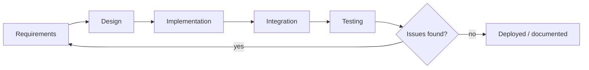
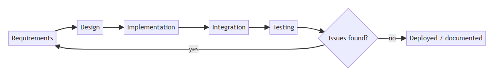

# 3. Requirements Engineering

*SDLC phase: Requirements*

## 3.1 Development Methodology

SVDS was built iteratively rather than to a single upfront specification: the registry
web application (backend + frontend) and the camera-node detection pipeline were
developed as two work-streams that converged at one integration point — the
`POST /alerts/check-plate` endpoint. This let the detection model's training/evaluation
cycle (data collection → annotation → training → evaluation, see Chapter 5) proceed
independently of the web application's CRUD/auth work, and let each be iterated and
retested without blocking the other.

## 3.2 Required Resources

| Layer | Technology |
|---|---|
| Backend | Python, FastAPI, SQLAlchemy (ORM), PostgreSQL, JWT (`python-jose`), bcrypt (`passlib`) |
| Frontend | React 18, React Router, Axios, Vite |
| Camera node | Python, OpenCV, Ultralytics YOLOv8, EasyOCR, PyTorch (CUDA) |
| Dataset/annotation | Roboflow (annotation, augmentation, dataset versioning/export) |
| Dev/runtime | Windows 11, NVIDIA GPU (CUDA) for training and real-time inference, Android phone running an IP Webcam app as the camera source |

Development environments are isolated per component: the backend uses a Python venv
with `psycopg2-binary` for Postgres connectivity; the camera node requires a
GPU-enabled Python environment with `torch`/`ultralytics`/`easyocr` installed
(CPU-only inference is possible but materially slower for real-time video).

## 3.3 Requirements Gathering Approach

Requirements were derived from: (a) the practical gap identified in Chapter 1 (no
automatic cross-referencing of reports against field sightings), (b) the natural
three-way split of who interacts with a stolen-vehicle report — the person who filed
it, the officer investigating it, and the administrator managing accounts and system
health — and (c) the technical constraints of the detection pipeline itself (a
single, cheap camera source; the need to avoid coupling the detector to the backend's
release cycle).

## 3.4 Functional Requirements

### 3.4.1 Reportee (public)

- Register an account and log in (`POST /auth/register`, `/auth/login`).
- File a stolen-vehicle report with owner, vehicle, and incident details
  (`POST /reports/`); a duplicate report cannot be filed against a plate that already
  has an active (`missing`-status) report.
- View and search their own filed reports (`GET /reports/`, scoped to their own
  `reported_by`).
- View and edit their own profile (`GET/PATCH /users/me`), including changing password.

### 3.4.2 Police

- Everything a Reportee can do, plus:
- View, search, and filter all reports system-wide, not just their own.
- Activate a report (move it from `under_review` to `missing`, making it eligible for
  plate matching) and mark a report `found` once the vehicle is recovered
  (`PATCH /reports/{id}/activate`, `PATCH /reports/{id}/found`).
- View live detection alerts, mark them read, and flag false positives
  (`GET /alerts/`, `PATCH /alerts/{id}/read`, `PATCH /alerts/{id}/false-positive`).
- Receive new detection alerts in real time via WebSocket without refreshing the page.
- View the live camera feed and camera-node status (online/offline, detection count,
  average confidence) on the Cameras page.
- View system analytics: report totals/status breakdown, recovery rate, alerts over
  time, detections per camera node, average recovery time.

### 3.4.3 Admin

- Everything a Police user can do, plus:
- Create police/employee accounts (`POST /users/invite`), change any user's role
  (`PATCH /users/{id}/role`), deactivate/reactivate accounts, and delete accounts.
- Delete a stolen-vehicle report, including one with existing detection history
  (`DELETE /reports/{id}` — see §8.5 for why this specifically needed a fix).
- View the system-wide audit log of significant actions (`GET /system/audit`).
- View system health: API response time, DB connection pool usage, disk usage, active
  sessions, camera node online/offline count, uptime (`GET /system/health`).
- View user-growth analytics (`GET /analytics/user-growth`).

### 3.4.4 Camera node (SVDS detection subsystem)

- Connect to a live MJPEG video stream from a phone-mounted camera.
- Detect license plates in each processed frame using a custom-trained object
  detector, at a configurable confidence threshold.
- Extract and pre-process the detected plate region for OCR (grayscale, upscale,
  threshold).
- Read the plate text and validate it against the expected Zambian plate character
  pattern before treating it as a genuine reading.
- Suppress repeated reports of the same plate within a cooldown window, tolerant of
  OCR noise between frames (i.e., near-identical readings should not each trigger a
  separate report).
- Report each accepted reading to the backend over HTTP, and log the backend's
  response (CLEAR/STOLEN) locally.
- Recover automatically if the video stream connection drops.

## 3.5 Non-Functional Requirements

- **Security:** passwords are never stored in plaintext (bcrypt hashing); every
  protected route requires a valid JWT; role checks are enforced server-side
  (`app/middleware.py`'s `require_role`), not only hidden in the frontend UI; the
  camera feed proxy and WebSocket endpoint both validate a JWT before granting access,
  since `` tags and WebSocket handshakes cannot send an `Authorization` header.
- **Performance:** the detection pipeline processes every 5th frame (not every frame)
  to keep pace with the video stream on the available GPU; database aggregate queries
  in the analytics/system routers use SQL-side counting/averaging rather than pulling
  full row sets into Python.
- **Availability/resilience:** the camera node reconnects automatically if the phone
  stream drops; the backend's WebSocket manager removes dead connections on broadcast
  failure rather than blocking on them.
- **Decoupling:** the camera node has no dependency on the backend's internals — it is
  a separate OS process communicating only over HTTP/JSON, so it can be redeployed,
  restarted, or replaced independently (see Chapter 7).
- **Usability:** each role sees only the navigation and actions relevant to it (the
  frontend's route guards mirror the backend's role checks) so users are not shown
  controls they cannot use.
- **Maintainability:** the schema is defined once in SQLAlchemy models and shared by
  every router; business rules that matter to more than one endpoint (e.g., confidence
  normalization) are factored into a single expression rather than duplicated.
- **Auditability:** state-changing actions taken by police/admin users are written to
  an `audit_log` table, giving a traceable record of who activated, resolved, or
  deleted a report, and who changed a user's role.
