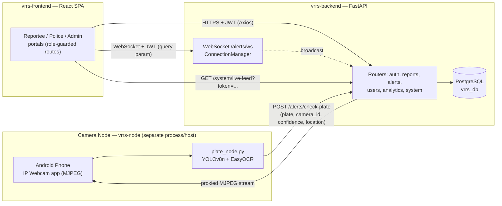
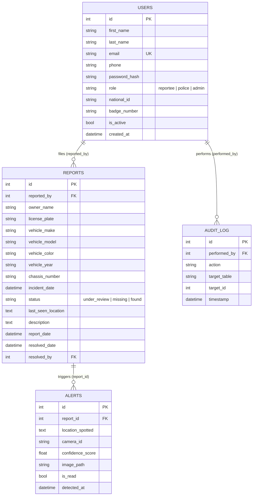
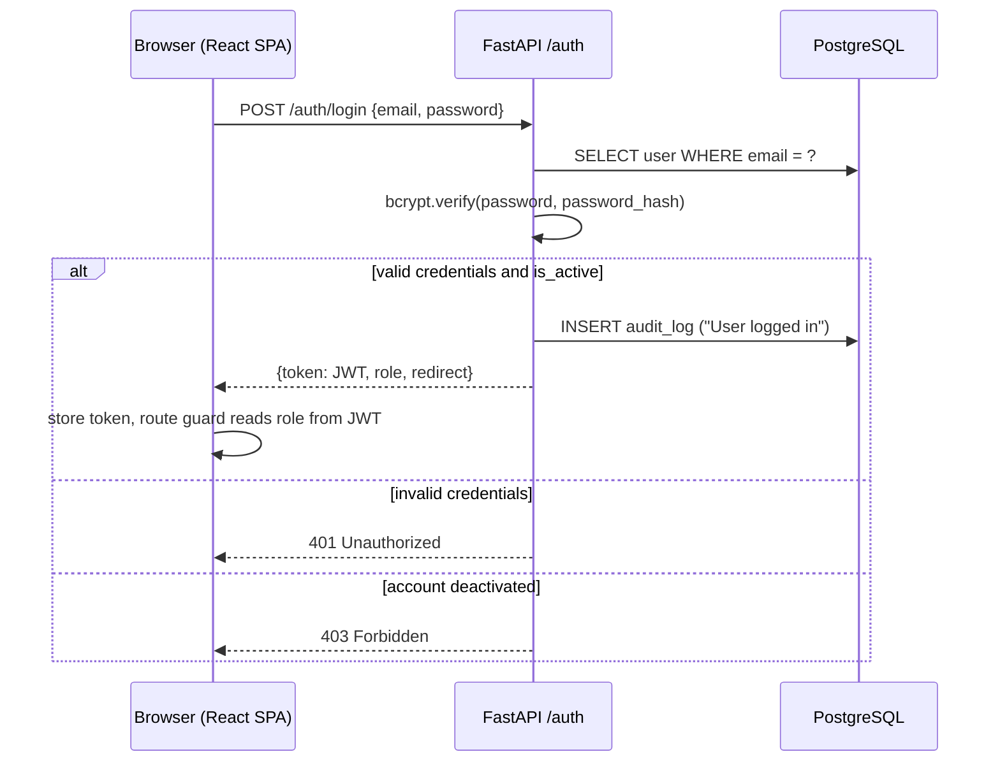
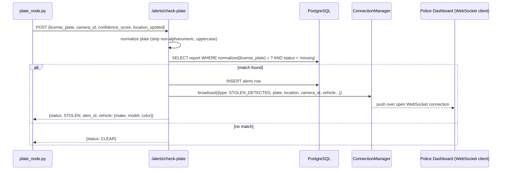
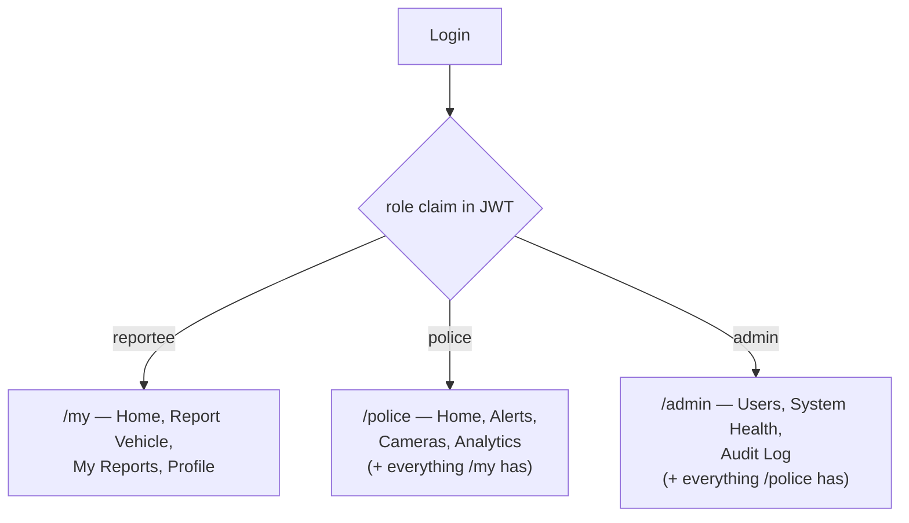

# 4. System Design

*SDLC phase: Design*

## 4.1 Proposed System

SVDS is composed of three independently-runnable processes that communicate only over
network calls, never by sharing code or a process boundary:

1. **`vrrs-backend`** — a FastAPI application backed by PostgreSQL, exposing REST
   endpoints and one WebSocket endpoint.
2. **`vrrs-frontend`** — a React single-page application consumed by browsers, talking
   to the backend over HTTPS (Axios) and WebSocket.
3. **`vrrs-node`** — a standalone Python script (`plate_node.py`) that pulls a phone's
   video stream, runs detection/OCR, and reports over plain HTTP.

## 4.2 System Architecture

This is deliberately not a monolith: the camera node does not import anything from
`vrrs-backend`, and could be pointed at a different backend entirely by changing one
environment variable (`BACKEND_URL`). This decision trades a small amount of network
overhead for the ability to develop, restart, and scale the detection pipeline
independently of the web application — see Chapter 7 for the integration contract in
detail.

## 4.3 Database Design (Entity-Relationship Diagram)

The schema has four tables, defined once in `vrrs-backend/app/models.py` and shared by
every router:

`Alert.report_id` carries `ON DELETE CASCADE` (see §8.5): deleting a report also
deletes its detection history rather than being blocked by the foreign key. `Report`
has no direct foreign key to `Alert`; the relationship is navigated the other way,
and `Alert.license_plate` is a computed property that reads through to
`Alert.report.license_plate` rather than being stored redundantly.

No formal migration tool (e.g., Alembic, though it is listed in `requirements.txt`) is
currently wired up — the schema is created with `Base.metadata.create_all()` at
backend startup, which creates missing tables but does not alter existing ones. This is
why the cascade fix in §8.5 required a direct `ALTER TABLE` against the live database
in addition to the model change (see §9.2 for this as a noted limitation).

## 4.4 API Design

| Router | Prefix | Purpose | Auth |
|---|---|---|---|
| Auth | `/auth` | Register (reportee only), login, logout | Public |
| Reports | `/reports` | Stolen-vehicle report CRUD + lifecycle transitions | Reportee+ (scoped), Police for updates, Admin for delete |
| Alerts | `/alerts` | `check-plate` (public, called by the camera node), alert listing/read/false-positive, WebSocket | Public for `check-plate`; Police+ for the rest |
| Users | `/users` | Profile, admin user management, role changes | Self for profile; Admin for management |
| Analytics | `/analytics` | Aggregate stats for dashboards/charts | Police+ (Admin for user-growth) |
| System | `/system` | Audit log, camera-node status, live-feed proxy, health metrics | Admin/Police, token-gated for the feed proxy |

`/alerts/check-plate` is intentionally unauthenticated (the camera node has no user
identity of its own) but is not a general write endpoint — it can only ever produce a
`CLEAR` response or create an `Alert` row linked to an already-`missing` report; it
cannot create, modify, or delete a report.

## 4.5 Sequence Design: Authentication

Every subsequent request attaches the JWT as a Bearer token; `app/middleware.py`
decodes it once per request (`get_current_user`) and layers role checks on top
(`is_reportee`, `is_police`, `is_admin`) rather than re-implementing auth logic per
route.

## 4.6 Sequence Design: Detection-to-Alert (the system's core value flow)

See Chapter 5 (§5.7) for the full pipeline diagram inside the camera node, and
Chapter 7 for the integration contract this sequence relies on.

## 4.7 Role/Access Design

Access is enforced identically in two places: server-side (FastAPI dependencies) and
client-side (React route guards), so the UI never shows a control the API would refuse.

(`vrrs-frontend/src/App.jsx`'s `Guard roles={[...]}` component and
`vrrs-backend/app/middleware.py`'s `require_role(*roles)` implement the two sides of
this same rule set.)

## 4.8 UI Design

The frontend has 14 pages split across four areas: public (`Login`, `Register`),
Reportee (`ReporteeHome`, `ReportVehicle`, `MyReports`, `Profile`), Police
(`PoliceHome`, `Alerts`, `Cameras`, `Analytics`), and Admin (`AdminHome`,
`UserManagement`, `SystemHealth`, `AuditLog`). A shared `PortalLayout` gives
role-appropriate navigation, and a global `AlertsContext` means a new detection toast
can appear on *any* page a police/admin user is viewing, not only the Alerts page —
this was a deliberate design choice so an officer reviewing analytics is not the last
to know about a live detection.
