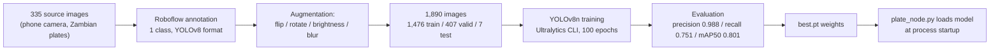
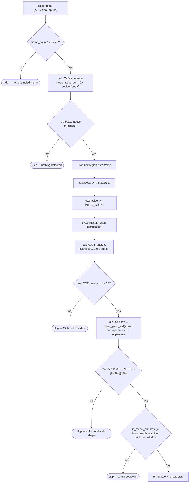
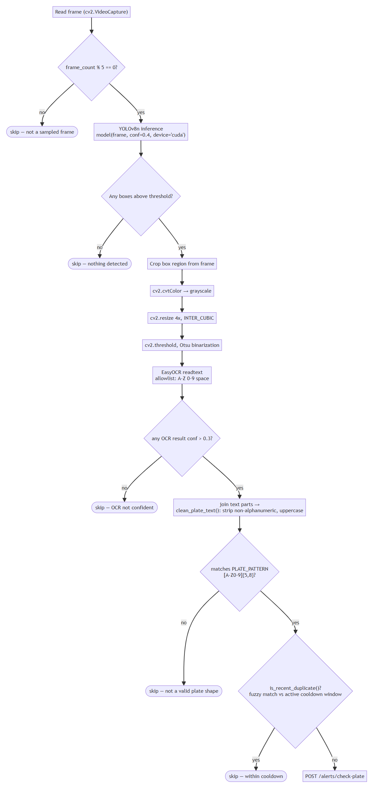

# 5. Object Detection & Plate Recognition Module

*This chapter documents the ML sub-lifecycle that Chapters 4 (Design) and 6
(Implementation) reference but don't repeat in full: data → annotation → training →
evaluation → deployment. Every figure and number in this chapter is copied directly
from the actual training run in `C:\Users\user\runs\detect\svds-plate-detector-final-2\`
— see `assets/detection-model/`.*

## 5.1 Why a custom-trained detector

Off-the-shelf ALPR models (§2.2.1) are trained on plate formats from the regions that
produced them and do not reliably localize the layout and proportions of Zambian
plates. Rather than adapt a general model, a single-class detector —
`zambia-number-plate-detection` — was trained from scratch on YOLOv8n's pretrained
COCO weights, fine-tuned only to localize "this region of the frame is a plate,"
leaving character recognition to a separate OCR stage (§5.6). Splitting localization
and recognition into two stages (rather than an end-to-end plate-reading model) keeps
each stage simple, independently testable, and swappable — the OCR engine could be
replaced without retraining the detector.

## 5.2 Data Collection

335 source images of vehicles bearing Zambian plates were collected by phone camera
(the same category of hardware the deployed camera node uses — see the `IMG_xxxx.jpg`
filename pattern from the source photography under `C:\Users\user\runs\detect\predict-6\`,
matching the phone-camera capture format used throughout this project). Collecting
images with the same kind of camera the system would actually use in the field —
rather than sourcing a generic plate dataset — was intentional: it means the training
distribution (angle, lighting, motion blur, resolution) matches the deployment
distribution.

## 5.3 Annotation

Images were annotated using Roboflow (project `zambia-number-plate-detection`,
workspace `nicholass-workspace-j3yig`), with a single bounding-box class per plate. The
dataset was exported in YOLOv8 label format (`assets/dataset/data.yaml`):

```yaml
names:
  - zambia-number-plate-detection
nc: 1
train: ../train/images
val: ../valid/images
test: ../test/images
```

## 5.4 Pre-processing and Augmentation

Roboflow's export pipeline applied (documented in `assets/dataset/README.roboflow.txt`):

- Auto-orientation (EXIF-orientation stripping)
- Resize to 640×640 (stretch)
- 3 augmented versions per source image: 50% chance of horizontal flip, random
  rotation (±15°), random brightness adjustment (±25%), and a small random Gaussian
  blur (0–1.8px) applied to bounding boxes

This grew the dataset from 335 source images to **1,890 images**, split:

| Split | Images |
|---|---|
| train | 1,476 |
| valid | 407 |
| test | 7 |




## 5.5 Training

Trained with the Ultralytics CLI/Python API. Actual hyperparameters, from
`assets/detection-model/args.yaml`:

| Parameter | Value |
|---|---|
| Base model | `yolov8n.pt` (pretrained, fine-tuned) |
| Epochs | 100 |
| Batch size | 8 |
| Image size | 640×640 |
| Device | GPU (`device: '0'`, NVIDIA Quadro P2000) |
| Optimizer | auto (Ultralytics default: SGD/AdamW selection) |
| Learning rate | `lr0=0.01`, `lrf=0.01`, cosine schedule off |
| Augmentation (in-training) | mosaic 1.0, `fliplr` 0.5, HSV jitter, `erasing` 0.4 |

This was one of several training runs (`svds-plate-detector`, `-2`, `-3`, `-final`,
`-final-2`, etc. — see the `runs/detect/` history); `svds-plate-detector-final-2` is
the run whose weights (`best.pt`) are the ones actually loaded by `plate_node.py` in
production (`MODEL_PATH` in `vrrs-node/.env`).

## 5.6 Evaluation

Final-epoch (100/100) metrics, read directly from `assets/detection-model/results.csv`:

| Metric | Value |
|---|---|
| Precision (B) | 0.988 |
| Recall (B) | 0.751 |
| mAP50 (B) | 0.801 |
| mAP50-95 (B) | 0.686 |

High precision with lower recall means the detector rarely produces a false bounding
box, but does sometimes miss a plate in a frame (e.g., under motion blur or extreme
angle) — an acceptable trade-off for this use case, since a missed detection in one
frame is very likely caught in a subsequent frame of the same vehicle passing the
camera (the pipeline evaluates every 5th frame of a live stream, not a single still
image), whereas a false-positive detection could file a spurious alert against an
innocent vehicle.

Supporting evaluation artifacts, copied from the real training run into
`assets/detection-model/`:

- `confusion_matrix.png`, `confusion_matrix_normalized.png`
- `BoxPR_curve.png`, `BoxF1_curve.png`, `BoxP_curve.png`, `BoxR_curve.png`
- `results.png` (loss/metric curves across all 100 epochs)
- `val_batch0_pred.jpg`, `val_batch1_pred.jpg` (real predicted bounding boxes on held-out
  validation images, alongside `val_batch0_labels.jpg` for ground-truth comparison)

**Figure 5.1** — training/validation loss and metric curves across all 100 epochs:


**Figure 5.2** — confusion matrix on the held-out validation set:


**Figure 5.3** — precision-recall curve:


**Figure 5.4** — real predicted bounding boxes (top) against ground-truth labels
(bottom) on held-out validation images:


## 5.7 OCR and Post-processing Pipeline

YOLO localizes a plate; it does not read the characters. `plate_node.py` runs a
fixed post-processing pipeline on each detected box before treating a reading as valid:





Every "skip" leaf simply falls through to the next iteration of the camera node's
`while True` loop (the next captured frame) — the diagram omits an explicit loop-back
edge to keep the layout readable; the loop itself is described in §5.7's prose and
shown in `plate_node.py`'s `main()`.

Why each stage exists:

- **Frame skipping (every 5th frame):** running YOLO + EasyOCR on every frame of a live
  stream would fall behind the incoming video on the available hardware; skipping
  frames trades a small amount of latency for keeping up with the stream in real time.
- **Grayscale → 4× resize → Otsu threshold:** a raw crop of a plate region is small and
  often low-contrast; upscaling and binarizing before OCR measurably improves EasyOCR's
  character accuracy on cropped regions this small.
- **Character allowlist:** restricting EasyOCR's output alphabet to `A-Z0-9` and space
  prevents it from "reading" background clutter as plausible-looking but wrong
  characters.
- **Regex validation (`clean_plate_text`, `vrrs-node/plate_utils.py`):** a Zambian plate
  cleans to 5–8 alphanumeric characters; anything outside that range is discarded
  rather than forwarded as a guess.
- **Fuzzy-match cooldown (`is_recent_duplicate`):** see §8.5 — this stage was rewritten
  during this project specifically because exact-string cooldown keys let OCR noise
  (`ALX3665` / `ALK3665` / `AL3065` for the same physical plate) bypass the cooldown
  entirely.

## 5.8 Deployment and Integration

`best.pt` is loaded once at process startup (`YOLO(MODEL_PATH)`, `model.to(DEVICE)`),
not per-frame or per-request — inference is a local, synchronous call inside the same
process reading the video stream. The camera node has no HTTP endpoint of its own for
running inference; it only ever calls *out* to the backend once a reading passes all
of the checks above. This is discussed further as an integration decision in
Chapter 7, including why detection deliberately does **not** happen inside the FastAPI
backend (the generic `POST /model/predict-image` endpoint in
`app/routers/model.py` exists as a placeholder in the codebase but is not the
production detection path — see §7.4).
