# 6. System Implementation

*SDLC phase: Construction. This chapter covers how each part was actually built. All
web-UI screenshots below are real captures of the running system (`assets/screenshots/`)
— taken via headless Chrome driven over the DevTools Protocol against the live
`vrrs-backend`/`vrrs-frontend` processes, logged in with real, server-issued JWTs for
throwaway demo accounts (`demo.reportee@vrrs-thesis.local`, `demo.police@...`) plus the
repository's own seeded admin account. The numbers they show (18 reports, 72.2%
recovery rate, 21 users, etc.) are the live database's real state at capture time, not
mocked. The camera-node preview window and a live end-to-end detection could not be
captured this session because the phone's IP Webcam stream was not reachable at the
time — see the note in §6.3.*

## 6.1 Backend (`vrrs-backend`)

### 6.1.1 Structure

```
vrrs-backend/
├── app/
│   ├── main.py          FastAPI app, CORS, router registration
│   ├── database.py      SQLAlchemy engine/session (reads DATABASE_URL from .env)
│   ├── models.py        ORM models: User, Report, Alert, AuditLog
│   ├── schemas.py       Pydantic request/response schemas
│   ├── auth.py          bcrypt hashing, JWT create/decode
│   ├── middleware.py    get_current_user, require_role, is_reportee/police/admin
│   └── routers/
│       ├── auth.py       register, login, logout
│       ├── reports.py    report CRUD + lifecycle
│       ├── alerts.py     check-plate, alert list/read/false-positive, WebSocket
│       ├── users.py      profile, admin user management
│       ├── analytics.py  aggregate stats
│       ├── system.py     audit log, camera-node status, live-feed proxy, health
│       └── model.py      generic (unused) predict/predict-image placeholder — see §7.4
└── tests/                 automated test suite added during this project (Ch. 8)
```

### 6.1.2 Auth and role enforcement

Passwords are hashed with bcrypt (`passlib.CryptContext`) and never stored or logged in
plaintext. `create_access_token` issues a JWT carrying the user's id and role, expiring
after `TOKEN_EXPIRY_HOURS` (default 24h). Every protected route depends on
`get_current_user` (decodes and validates the token) and, where relevant, a role-scoped
dependency (`is_reportee`, `is_police`, `is_admin`) built from a single
`require_role(*roles)` factory — so a new role restriction is one line, not a
duplicated `if` check per route.

### 6.1.3 Report lifecycle

A report moves through three states: `under_review` (just filed, not yet checked
against live detection) → `missing` (activated by police, now eligible for plate
matching) → `found` (recovered). Creating a report rejects a duplicate only against an
already-`missing` plate, not an `under_review` one — a nuance surfaced by the automated
test suite (§8.4) and documented as a known, unaddressed edge case rather than silently
left undocumented.

### 6.1.4 Alerts and the detection contract

`POST /alerts/check-plate` (the endpoint the camera node calls) normalizes both the
incoming reading and every stored plate the same way — stripping everything but
letters and digits and upper-casing — before comparing them, so `"baa 1234"`,
`"BAA1234"`, and `"BAA-1234"` all match the same report. On a match it creates an
`Alert` row and broadcasts a `STOLEN_DETECTED` message to every connected
police/admin WebSocket client; on no match it returns `CLEAR` and writes nothing.

**Figure 6.1** — the live `/docs` Swagger UI, showing the full router list actually
registered on this running instance (Authentication, Reports, Alerts, Users,
Analytics, System):

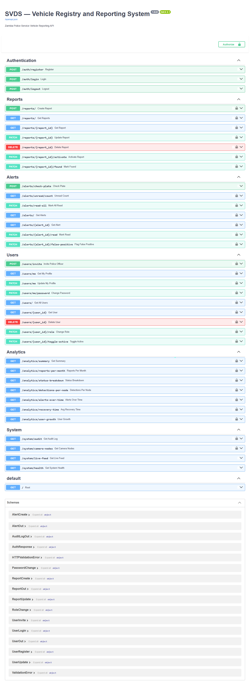

## 6.2 Frontend (`vrrs-frontend`)

### 6.2.1 Structure

14 pages across 4 areas (`src/pages/{admin,police,reportee}/*.jsx`, plus `Login.jsx`
and `Register.jsx`), a shared `AuthContext` (JWT + role, persisted across reloads), an
`AlertsContext` that opens the WebSocket connection once and makes new-alert toasts
available app-wide via `NotificationToast`, and a `ProtectedRoute`/`Guard` component
that redirects away from any route the current role isn't allowed on.

### 6.2.2 Key screens

All captured live, logged in as real accounts (a throwaway demo Reportee, a demo
Police officer created via `/users/invite`, and the repository's seeded Admin
account), against the real database (18 reports, 21 users at capture time):

| Figure | File | Page |
|---|---|---|
| 6.2 | `login.png` | `/login` |
| 6.3 | `register.png` | `/register` |
| 6.4 | `reportee-home.png` | `/my` |
| 6.5 | `report-vehicle.png` | `/my/report` — the report-filing form |
| 6.6 | `my-reports.png` | `/my/reports` — showing the demo reportee's own filed report |
| 6.7 | `police-home.png` | `/police` — vehicle registry, 18 total reports, 72.2% recovery rate |
| 6.8 | `alerts.png` | `/police/alerts` — live alert feed (0 unread at capture time; the 23 existing alerts in the DB had already been read/actioned in earlier sessions) |
| 6.9 | `cameras.png` | `/police/cameras` — correctly shows `PHONE-NODE-1` as **offline**, matching reality: the camera node was not connected during this capture (§6.3) |
| 6.10 | `analytics.png` | `/police/analytics` — real chart data, including **avg. detection confidence 88.2%**, which is the post-fix, correctly-normalized figure described in §8.5 |
| 6.11 | `admin-home.png` | `/admin` — system overview, 21 total users, 4 police accounts |
| 6.12 | `user-management.png` | `/admin/users` — includes the demo accounts created for this capture session |
| 6.13 | `system-health.png` | `/admin/health` — live metrics (68.2% disk usage, 151.4GB free, 1/15 DB connections in use, 21 active sessions); this page took a genuinely reproducible ~3–4s to populate on first load in dev mode (Vite's on-demand route compilation), confirmed by polling the DOM directly rather than assumed |
| 6.14 | `audit-log.png` | `/admin/audit` — real audit rows, including the login events generated by capturing these very screenshots |

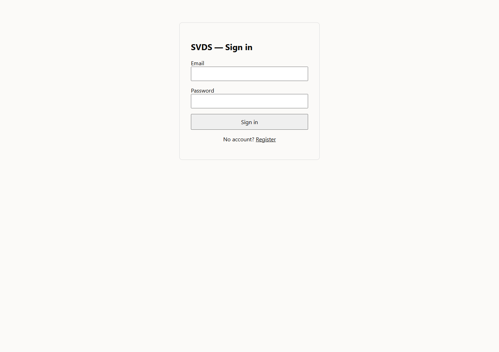
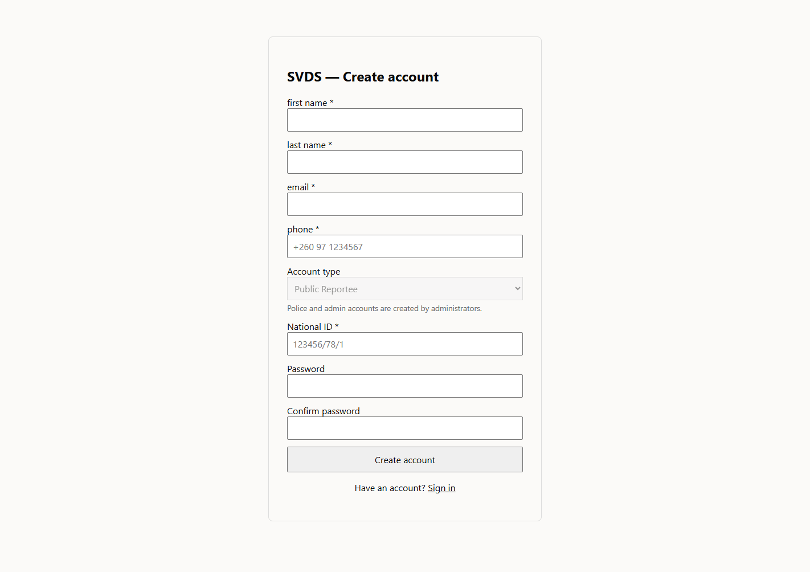
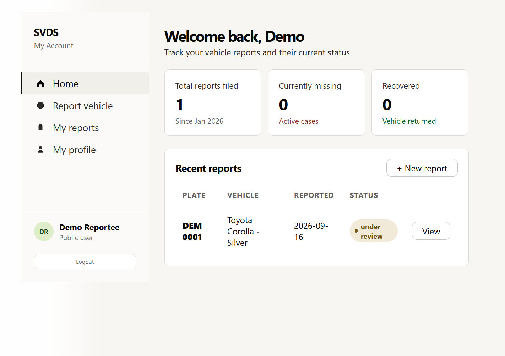
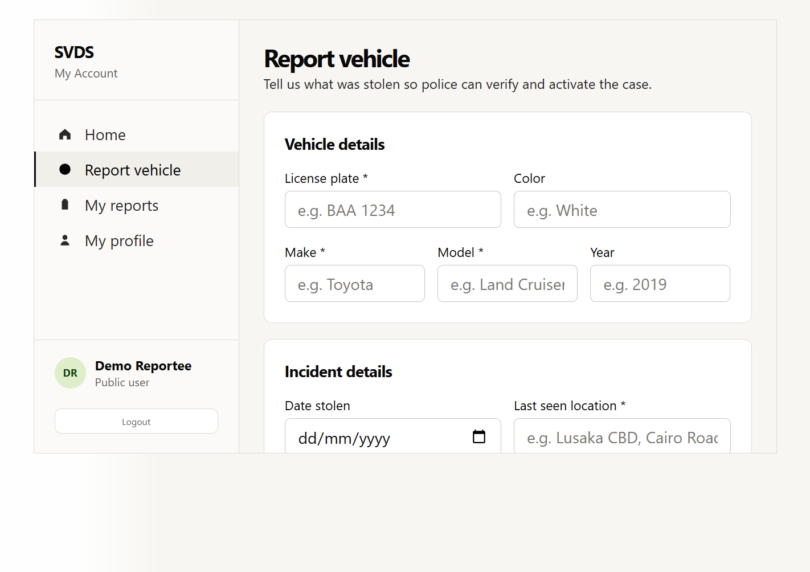
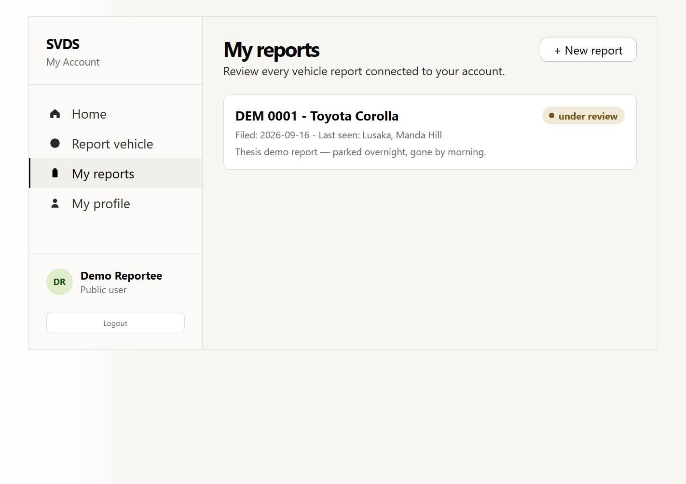
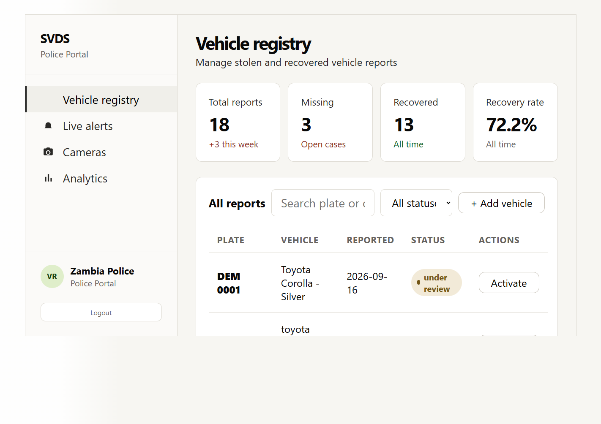
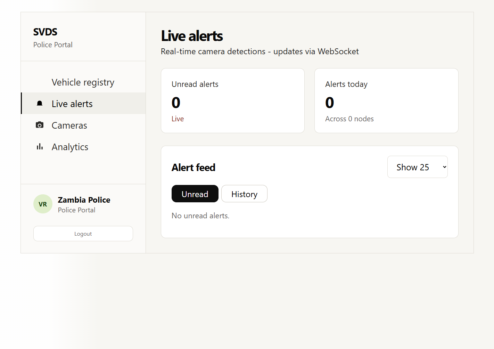
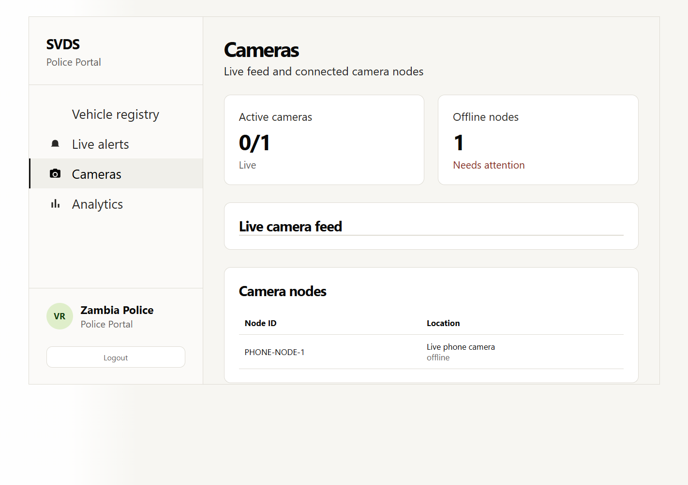
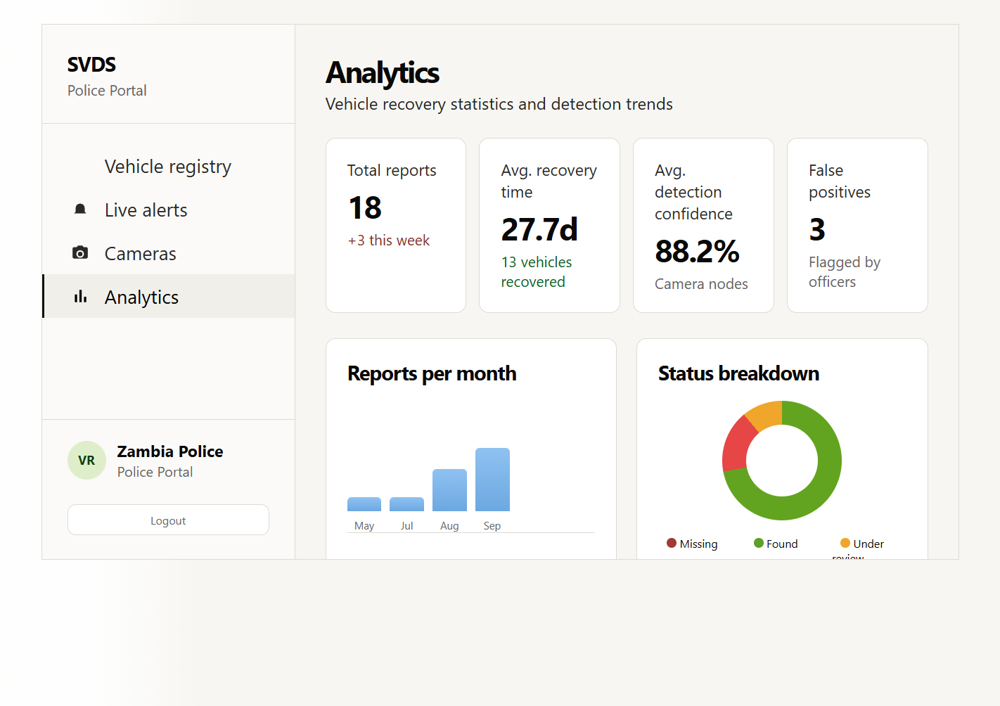
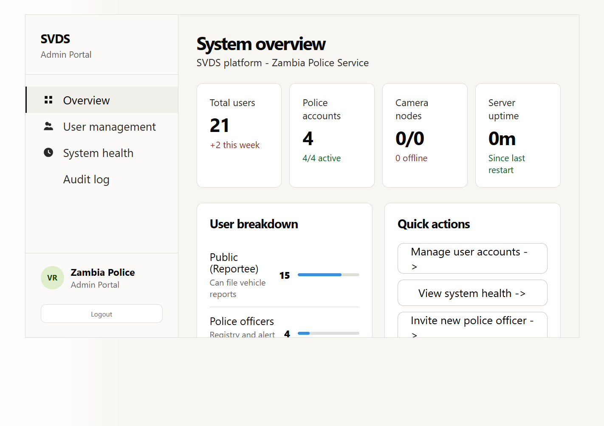
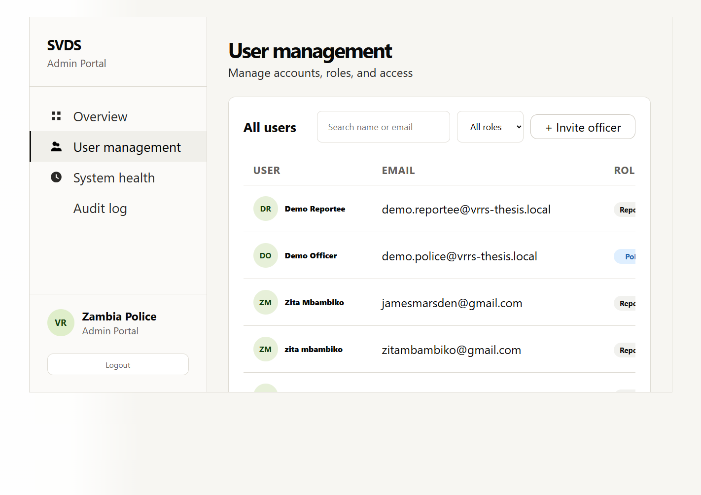
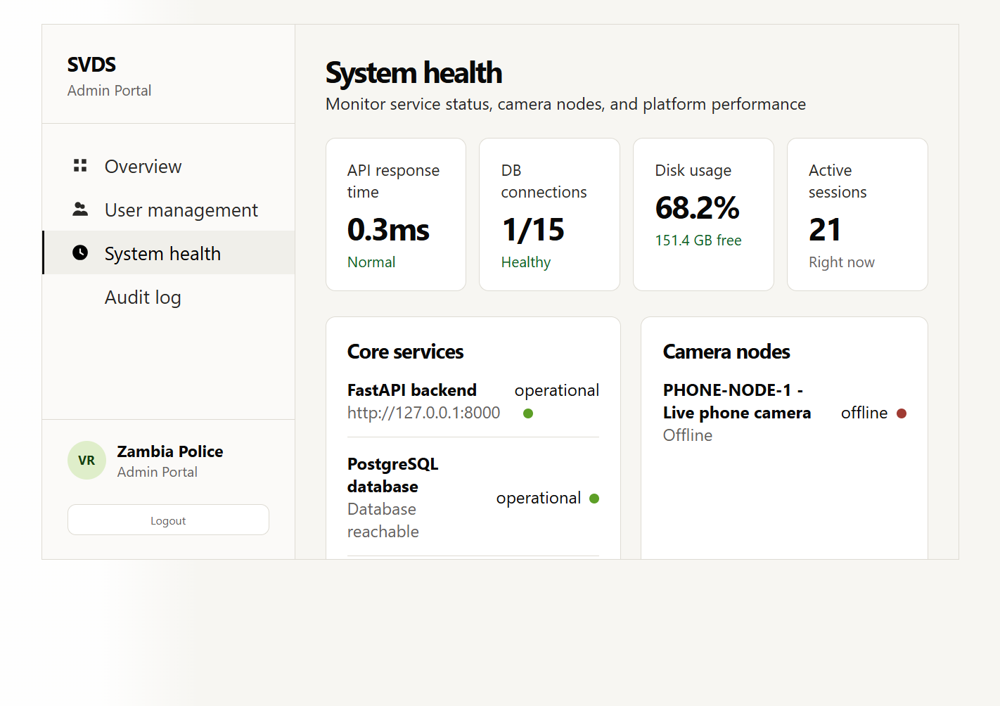
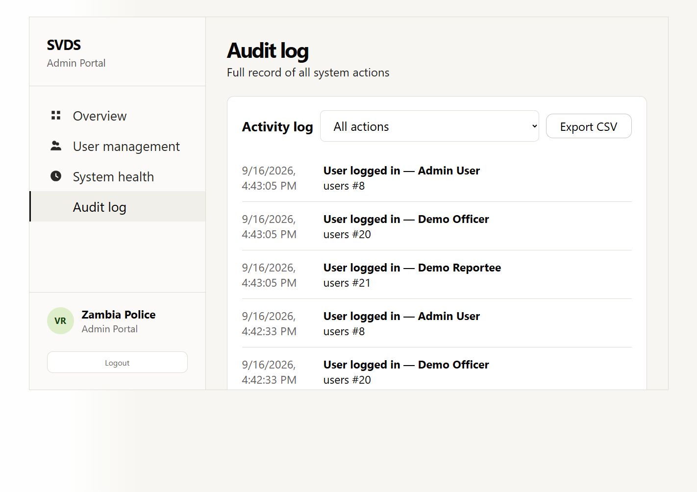

Not captured: a live WebSocket detection toast, and the camera node's OpenCV preview
window. Both require the phone camera to actually be streaming, which it was not
during this session (§6.3, §7.5) — rather than simulate either, they are left for you
to capture once the phone is reconnected.

### 6.2.3 Real-time alerts

`AlertsContext` opens `wss://.../alerts/ws?token=<JWT>` once on login (for
police/admin roles only) and keeps it open across route changes, rather than each page
opening its own connection. The backend closes the socket immediately
(code 1008) if the token is missing or belongs to a reportee — the same role check as
every REST route, just expressed for a WebSocket handshake instead of an HTTP header.

## 6.3 Camera Node (`vrrs-node`)

`plate_node.py` is the single entry point; the pure plate-cleaning/dedup logic lives in
`plate_utils.py` (added during this project specifically so it could be unit tested
without a GPU environment — see §8.3). It is started independently of the backend and
frontend (`run-all.ps1` opens all three in separate windows for development) and only
ever communicates outward over HTTP.

**Verified this session, not simulated:** running `run-all.ps1` did start all three
processes — the backend and frontend came up and responded correctly to real requests
(confirmed via direct HTTP checks), and the camera node's Python process loaded
YOLOv8n/EasyOCR successfully. It then exited because the configured
`PHONE_STREAM_URL` (`http://172.20.10.2:8080/video`) was unreachable (confirmed with
`Test-NetConnection`: `TcpTestSucceeded: False`) — the phone's IP Webcam app was not
running/connected at the time. This is reported plainly rather than glossed over:

`[SCREENSHOT NEEDED: node-preview-window.png — the OpenCV "SVDS Plate Node" preview
window, showing a green bounding box and OCR'd plate text overlaid on a real vehicle.
Requires the phone stream to actually be connected — see Appendix 2.3 for setup.]`
`[SCREENSHOT NEEDED: node-console.png — the terminal output showing "backend status:
STOLEN" or "backend status: CLEAR" for a real reading]`

## 6.4 Configuration

Each component reads its configuration from its own `.env` (never committed —
`.env.example` documents the required keys): the backend needs `DATABASE_URL`,
`SECRET_KEY`, `CORS_ORIGINS`, and the camera-proxy settings; the frontend needs
`VITE_API_BASE_URL`/`VITE_WS_URL`; the camera node needs `MODEL_PATH`,
`PHONE_STREAM_URL`, `BACKEND_URL`, `CAMERA_ID`, and the detection tuning parameters
(`DETECT_CONF`, `PROCESS_EVERY_N_FRAMES`, `RESEND_COOLDOWN_SECONDS`,
`DEDUP_SIMILARITY_THRESHOLD`).
