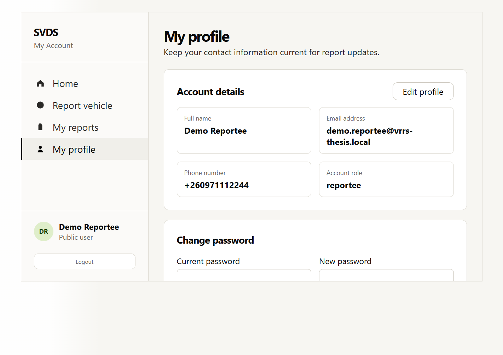

# Appendix B: User Manual / Installation Guide

This guide covers the front end and how to use each portal. Backend and camera-node set-up are in the other members' reports.

## B.1 Requirements

- Node.js and npm.
- The backend running and reachable (default `http://localhost:8000`).

## B.2 Install and run

```bash
cd vrrs-frontend
npm install
cp .env.example .env
npm run dev
```

The app runs at `http://localhost:5173`. `.env` holds `VITE_API_BASE_URL=http://localhost:8000` and `VITE_WS_URL=ws://localhost:8000`. For a production build:

```bash
npm run build      # writes static files to dist/
```

Serve `dist/` from any static web host, with the two variables set to the deployed backend before building. Note the deployment caveat in finding D-1: the backend's allowed origins are hard-coded and must be changed in its code.

## B.3 Using the application

**Everyone**
- **Register** (public): first and last name, email, telephone (`+260 XX XXXXXXX`), national ID (`NNNNNN/NN/N`) and a password of at least 6 characters. Registration creates a reportee.
- **Sign in:** you are taken to the portal for your role. *Note:* if you type a wrong password the page reloads with no message (finding U-1); check your details and try again.

**Reportee**
- *Report vehicle:* enter the plate and vehicle details, when and where it was last seen, and a description; submit. The report starts as "under review".
- *My reports:* see your reports and their status (under review, missing, found).
- *Profile:* edit your details and change your password.

**Police**
- *Vehicle registry:* search by plate or owner, filter by status. **Activate** an under-review report so cameras can match it; **mark found** when the vehicle is recovered.
- *Live alerts:* review unread alerts; mark read, mark all read, or flag a false positive. A notification appears on any page when a stolen vehicle is detected.
- *Cameras:* live feed and node status.
- *Analytics:* totals, average recovery time, average detection confidence, false positives, reports per month, status breakdown and detections by location.

**Administrator**
- *Overview*, *User management* (invite police, change role, deactivate or reactivate, delete with confirmation), *System health*, *Audit log*.

## B.4 Reading the analytics

| Figure | Meaning |
|---|---|
| Recovery rate | Found reports as a percentage of **all** reports, including ones not yet worked |
| Avg. recovery time | Mean days between filing and being marked found |
| Avg. detection confidence | Mean confidence of **all** alerts, including ones later flagged as false |
| False positives | Alerts flagged as false, counted from the audit log |
| Reports per month | Months with no reports are not shown; bar heights are capped, so compare the printed counts, not the bar heights |

## B.5 Troubleshooting

| Symptom | Likely cause | Action |
|---|---|---|
| Blank or "Loading" page | The backend is not running or unreachable | Start the backend; reload |
| Signed straight back out | Token expired (24 hours) or backend restarted with a different key | Sign in again |
| No alert notifications | The alert connection dropped (see the real-time report) | Reload the page |
| Browser blocks API calls (CORS) | The front end's address is not in the backend's hard-coded list | Add it in the backend's `main.py` |

## B.6 Run the checks

```bash
cd vrrs-frontend && npm run build          # compile check
cd ../vrrs-backend && python -m pytest tests/ -v
cd ../vrrs-node && python -m pytest tests/ -v
```

---

# Appendix C: Additional System Designs / Diagrams

## C.1 Further screens (captured earlier from the running application)




## C.2 Iterative development cycle


## C.3 Authentication sequence


---

# Appendix D: Additional Test Cases and Results

## D.1 Production build output

```
vite v5.4.21 building for production...
107 modules transformed.
dist/index.html                 0.43 kB | gzip:  0.30 kB
dist/assets/index-*.css        13.50 kB | gzip:  3.53 kB
dist/assets/index-*.js        263.64 kB | gzip: 82.49 kB
built in 2.31s
```

## D.2 Browser check (raw output)

```
marker after wrong-password click -> None   (None means the page reloaded)
visible error text -> 'SVDS - Sign in\nEmail\n\nPassword\n\nSign in\n\nNo account? Register'
frame navigations after initial load: 2
login response statuses: [200, 401]
labels with for attr: 0 of 2
```

The script started headless Chrome, opened the login page, typed a made-up email and password, clicked Sign in, and read the page. It wrote nothing to the database (the server rejected the login). The backend and dev server were started for the check and stopped afterwards.

## D.3 Analytics probes (raw output)

```
PROBE reports-per-month (6): [('May',1), ('Jul',1), ('Aug',1), ('Sep',2)]
PROBE summary reports: {'total':5,'missing':3,'found':1,'under_review':1,'new_this_week':1,'recovery_rate':20.0}
PROBE recovery-time: {'avg_days':6.0,'fastest_days':6,'slowest_days':6,'total_recovered':1}
PROBE detections-per-node rows for one camera: [('CAM-X','Cairo Rd',1), ('CAM-X','Cairo Road',1)]
PROBE confidence stored 1.0 -> avg shown: 100.0
PROBE alerts-over-time (30d) points: 2 for 2 alert-days
PROBE false_positives after unrelated audit row containing the phrase: 1
PROBE months=0 -> 422 | days=3 -> 422
```

## D.4 Coverage (raw output)

```
COV auth.py 24/26 = 92.3%        COV routers\alerts.py    75/110 = 68.2%
COV database.py 12/16 = 75.0%    COV routers\analytics.py 50/72  = 69.4%
COV main.py 31/39 = 79.5%        COV routers\auth.py      42/43  = 97.7%
COV middleware.py 23/27 = 85.2%  COV routers\model.py      0/38  =  0.0%
COV model.py 0/23 = 0.0%         COV routers\reports.py   65/87  = 74.7%
COV models.py 61/61 = 100.0%     COV routers\system.py    37/117 = 31.6%
COV schemas.py 114/114 = 100.0%  COV routers\users.py     31/115 = 27.0%
COV TOTAL 565/888 = 63.6%   (pytest exit 0; 31 passed)
```

---

# Appendix E: Data Collection Instruments

Not applicable. No questionnaires, interviews or surveys were used.

---

# Appendix F: Additional Code / Configuration

## F.1 The response handler behind finding U-1 (`services/api.js`)

```js
api.interceptors.response.use(
    (response) => response,
    (error) => {
        if (error.response?.status === 401) {
            localStorage.clear();
            window.location.href = "/login";
        }
        return Promise.reject(error);
    }
);
```

A wrong password also returns 401, so the page is reloaded before the login form can display the server's message. A fix is to skip the redirect when the request was to `/auth/login`.

## F.2 Bar height (`pages/police/Analytics.jsx`)

```jsx
style={{ height: `${Math.max(20, Math.min((m.count || 1) * 10, 170))}px` }}
```

Counts of 1 and 2 both give 20 px; counts of 17 or more all give 170 px (finding U-6).

## F.3 Confidence normalisation (`routers/analytics.py`)

```python
NORMALIZED_CONFIDENCE = case(
    (Alert.confidence_score <= 1, Alert.confidence_score * 100),
    else_=Alert.confidence_score,
)
```

## F.4 Front-end environment template (`vrrs-frontend/.env.example`)

```
VITE_API_BASE_URL=http://localhost:8000
VITE_WS_URL=ws://localhost:8000
```

---

# Appendix G: Other Supporting Material

## G.1 Group role split

| Role | Work areas | Focus |
|---|---|---|
| 1. AI/vision | Detection model; camera node | YOLOv8n detector, OCR pipeline |
| 2. Backend and security | Backend API and database; security and access control | FastAPI, PostgreSQL, JWT, roles |
| 3. Real-time and integration | Real-time alerts and monitoring; phone-to-server wiring | WebSocket, camera status, feed proxy, health |
| 4. Frontend | Frontend portals; analytics, testing and documentation | **This report** |

## G.2 Findings summary

| ID | Finding | Severity |
|---|---|---|
| U-1 | Failed login shows no error (page reloads) | High |
| U-2 | Every 401 treated as an expired session (cause of U-1) | High |
| U-3 | Login labels not associated with inputs | Medium |
| U-4 | Several data loads have no error handling | Medium |
| U-5 | Registry search on every keystroke, no stale-reply guard | Low |
| U-6 | Empty periods omitted; bars not proportional | Medium |
| U-7 | One camera split into several rows | Low |
| U-8 | Stored 1.0 shown as 100% | Low |
| U-9 | False positives counted by searching audit text | Low |
| U-10 | Recovery rate and confidence definitions not stated on screen | Low |
| U-11 | No automated front-end tests | Medium |
| D-1 | README `CORS_ORIGINS` instruction has no effect | High (deployment) |
| D-2 | README omits run script, first admin, tests, phone app | Medium |
| D-3 | README camera example incomplete | Low |
| D-4 | Absolute developer path in `run-all.ps1` | Medium |
