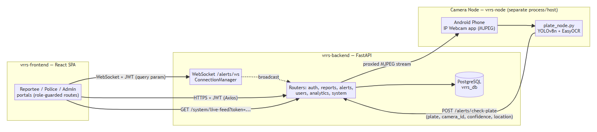

# Chapter 3: Methodology

## 3.1 Introduction

This chapter explains how the real-time and integration component was developed and evaluated: the approach, how requirements were obtained, the architecture, tools, ethical considerations and the evaluation method.

## 3.2 Research / Development Approach

The project was built **iteratively**. The web application and the camera-node pipeline were two work-streams that met at `POST /alerts/check-plate`. For this component the work proceeded from the seam outward: first agree what the camera sends and what the backend answers, then add the broadcast on a match, then the browser's connection and the toast, then camera status, the feed proxy and the health endpoint, and finally the start-up script.

Verification followed a **probe-and-record** approach, as in the backend report: after the features worked, the code was read for failure modes, each suspected failure was turned into a short temporary test, and only behaviour actually observed was recorded (§6.4).

```
Requirements → Design → Implementation → Integration → Testing / Failure-mode review → (issues found? back)
```

## 3.3 Requirements / Data Collection

Requirements came from (a) the gap in Chapter 1, (b) what officers need to see (an alert wherever they are, the camera, whether the system is up), and (c) what the other members' components needed: the camera node needs a stable endpoint, and the front end needs a message shape to render. No stakeholder interviews or user studies are recorded, so the requirements are the group's own analysis.

The data flowing through this component is operational: plate strings, camera identifiers, confidence values, locations and vehicle make, model and colour from the matched report. Test data is synthetic (for example plate `RT12345`).

## 3.4 System Architecture / Research Workflow



Three independently run processes communicate only over the network. This component owns the arrows between them: the camera node to backend call, the backend to browser WebSocket, and the proxied camera feed.

## 3.5 Tools and Technologies

| Area | Technology |
|---|---|
| Server-side WebSocket | FastAPI 0.111.0 / Starlette WebSocket support, served by Uvicorn 0.29.0 (`uvicorn[standard]`) |
| HTTP client for camera checks and proxy | `requests` |
| Streaming | `StreamingResponse` relaying an MJPEG stream (`multipart/x-mixed-replace`) |
| Browser side | Native `WebSocket` API; React context (`AlertsContext`) |
| Camera source | Android phone running an IP Webcam app (MJPEG over Wi-Fi/hotspot) |
| Start-up | PowerShell script `run-all.ps1` |
| Testing | pytest, Starlette `TestClient` (including `websocket_connect`), a small local HTTP server standing in for the camera |
| OS | Windows 11 |

## 3.6 Ethical and Legal Considerations

- **Who receives alerts.** Alerts contain a plate, a location and the vehicle's make, model and colour. They go only to police and admin connections; reportee, missing and invalid tokens are refused (tested).
- **The camera feed.** A live feed can capture people as well as vehicles. It is limited to police and admin tokens. A real deployment would need a lawful basis, signage and a retention policy; none of these is provided by the code, and the feed is not recorded by the system.
- **Token in the URL.** Both the WebSocket and the feed take the token as a query parameter because the browser cannot send a header. Such URLs can appear in logs, so tokens can leak into log files (§6.4).
- **False alerts.** A wrong alert could send officers to an innocent driver. The alert is a lead for a human, and officers can flag false positives.
- **Health endpoint disclosure.** The health endpoint reveals disk space, database pool use, user and report counts and camera state. It is currently unauthenticated (§6.4).
- **Responsible testing.** Probes ran only against the project's own code in a test process; the local stand-in camera served only synthetic bytes. No live deployment or real camera was attacked or interfered with.

## 3.7 Evaluation Method

1. **Functional tests through the real WebSocket route** using the framework's test client: connect as police, cause a match, receive the message.
2. **Failure-mode probes** for authentication, disconnection handling and the health and status endpoints.
3. **A stand-in camera:** a local HTTP server that serves a short MJPEG-style stream, used to test the proxy and the online/offline logic without the real phone.
4. **Code review** of the browser code for reconnection and timers (read, not run).
5. **Objective-by-objective review** against R1 to R7 in §1.4.

Not done: measurements over a real network or with a real browser, load tests, tests with several server processes, or user evaluation.

## 3.8 Chapter Summary

The component was built seam-first and verified with in-process WebSocket tests, a stand-in camera and failure-mode probes. Results are about behaviour, not real-network timing.
