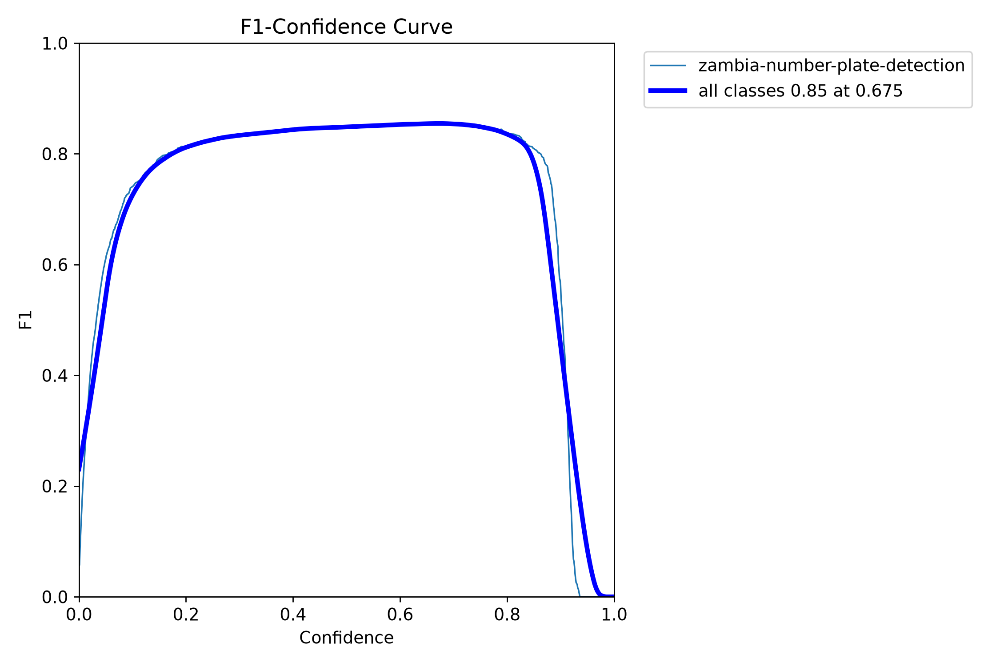
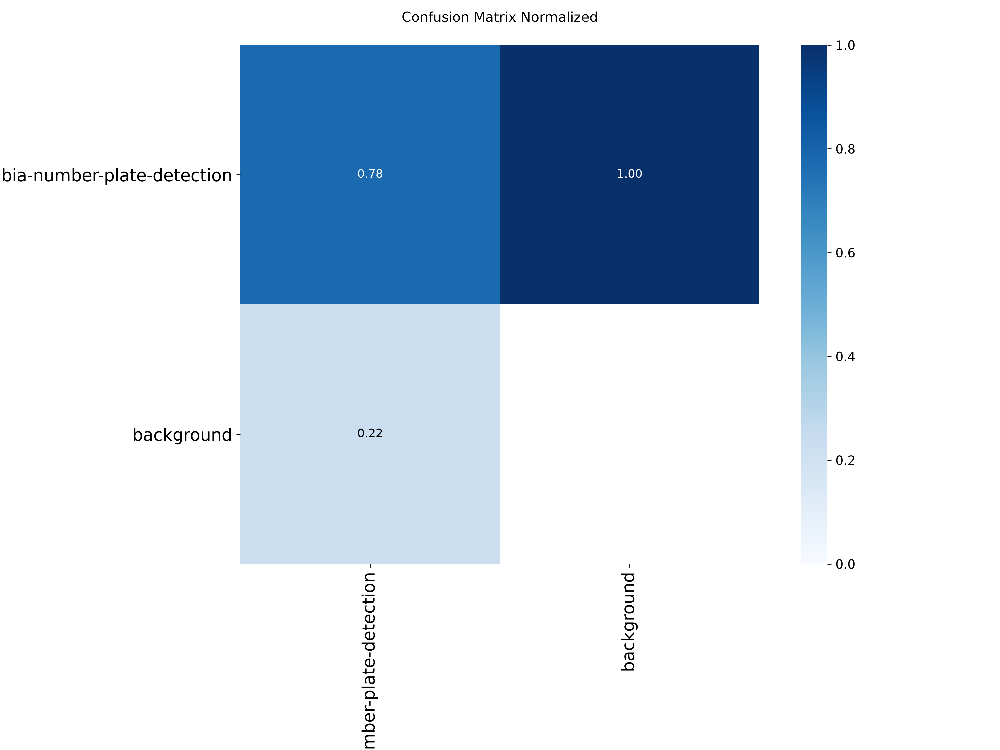

# Appendix B: User Manual / Installation Guide

This guide covers the camera node (the student's component). Set-up of the backend and frontend is documented in the project `README.md` and in the other members' reports.

## B.1 Requirements

- Windows 11 (or another OS with a CUDA-capable GPU setup).
- A Python environment with GPU-enabled `torch`, `ultralytics`, `easyocr`, `opencv-python` (not the headless build, since the preview window needs GUI support), `requests`, `python-dotenv`. The development environment is listed in §5.2.
- The trained weights `best.pt`.
- An Android phone running an IP Webcam app, on the same network or hotspot as the PC.
- The SVDS backend running and reachable.

## B.2 Configure

```bash
cd vrrs-node
cp .env.example .env
```

Edit `.env`:

| Key | Meaning | Default |
|---|---|---|
| `PHONE_STREAM_URL` | Stream address shown by the phone app, with `/video` appended | `http://192.168.1.100:8080/video` (example) |
| `BACKEND_URL` | Base URL of the SVDS backend | `http://127.0.0.1:8000` |
| `CAMERA_ID` | Identifier sent with every reading | `PHONE-NODE-1` |
| `LOCATION_SPOTTED` | Location text sent with every reading | `Unknown` |
| `MODEL_PATH` | Path to `best.pt` | see `.env.example` |
| `DETECT_CONF` | Detector confidence threshold | 0.4 |
| `PROCESS_EVERY_N_FRAMES` | Run detection on every Nth frame | 5 |
| `RESEND_COOLDOWN_SECONDS` | Duplicate-suppression window | 15 |
| `DEDUP_SIMILARITY_THRESHOLD` | Fuzzy match threshold, 0–1 | 0.75 |
| `DEVICE` | `cuda` or `cpu` | `cuda` |

The phone's address changes when it reconnects, so update `PHONE_STREAM_URL` each session.

## B.3 Run

1. Start the IP Webcam app on the phone and tap **Start server**.
2. Start the backend.
3. From `vrrs-node`, run `python plate_node.py` in the GPU environment (or run `run-all.ps1` from the project root to start all three components).
4. Wait about 20–30 seconds while the models load.
5. A window titled "SVDS Plate Node" opens. A green box and the plate text appear on detected plates. The console prints `[PLATE] backend status: CLEAR` or `STOLEN`.
6. Press `q` in the preview window to quit.

## B.4 Troubleshooting

| Symptom | Likely cause | Action |
|---|---|---|
| `Could not open video stream` at start-up | Wrong or unreachable `PHONE_STREAM_URL`; phone app not running; different network | Check the phone app, network and `.env` |
| `Lost connection to stream, retrying...` repeated | Phone went to sleep or left the network | Wake the phone, check the network; the node retries automatically |
| `failed to reach backend` | Backend not running or wrong `BACKEND_URL` | Start the backend; detection continues meanwhile |
| Crash on start mentioning `libiomp5md.dll` | Duplicate OpenMP runtimes | The node sets `KMP_DUPLICATE_LIB_OK`; make sure it is running the unmodified `plate_node.py` |
| `import torch` fails with `WinError 126` | Damaged Visual C++ runtime | Repair "Microsoft Visual C++ 2022 X64 Minimum Runtime" |
| Preview window fails to open | Headless OpenCV installed alongside the normal build | Uninstall `opencv-python-headless` |

## B.5 Run the unit tests

```bash
cd vrrs-node
python -m pytest tests/ -v
```

The tests need only `pytest`; they do not import `torch`, `cv2` or `easyocr`.

---

# Appendix C: Additional System Designs / Diagrams

## C.1 Database schema (designed by the backend member)

The node's readings end up in the `alerts` table. The full schema of the four tables is shown for reference.


## C.2 Authentication sequence (backend member)


## C.3 Role-based route access (backend and frontend members)


---

# Appendix D: Additional Test Cases and Results

## D.1 Raw output of the node unit tests

```
platform win32 -- Python 3.12.10, pytest-9.1.1, pluggy-1.6.0
rootdir: ...\vrrs-node
collected 8 items

tests/test_plate_utils.py::test_clean_plate_text_strips_punctuation_and_uppercases PASSED
tests/test_plate_utils.py::test_clean_plate_text_rejects_too_short_or_too_long PASSED
tests/test_plate_utils.py::test_clean_plate_text_rejects_non_alphanumeric_only_input PASSED
tests/test_plate_utils.py::test_exact_repeat_within_cooldown_is_a_duplicate PASSED
tests/test_plate_utils.py::test_ocr_jitter_variants_are_treated_as_duplicates PASSED
tests/test_plate_utils.py::test_genuinely_different_plate_is_not_a_duplicate PASSED
tests/test_plate_utils.py::test_expired_entries_no_longer_count_as_duplicates PASSED
tests/test_plate_utils.py::test_expired_entries_are_pruned PASSED

============================== 8 passed in 0.06s ==============================
```

(Run again during the preparation of this report. The original capture is in `thesis/assets/test-results/node-pytest-output.txt`.)

## D.2 Further training evidence

Figures 6.2 to 6.6 in Chapter 6 are the training and evaluation plots. The precision and recall curves as a function of confidence (`BoxP_curve.png`, `BoxR_curve.png`) and the F1 curve (`BoxF1_curve.png`) are in `thesis/assets/detection-model/`.





---

# Appendix E: Data Collection Instruments

Not applicable. No questionnaires, interviews or surveys were used. The only data collected were plate photographs, described in §3.3.

---

# Appendix F: Additional Code / Configuration

## F.1 Configuration template (`vrrs-node/.env.example`)

```
PHONE_STREAM_URL=http://192.168.1.100:8080/video
BACKEND_URL=http://127.0.0.1:8000
CAMERA_ID=PHONE-NODE-1
LOCATION_SPOTTED=Unknown
MODEL_PATH=C:\Users\user\runs\detect\svds-plate-detector-final-2\weights\best.pt
DETECT_CONF=0.4
PROCESS_EVERY_N_FRAMES=5
RESEND_COOLDOWN_SECONDS=15
```

## F.2 Reporting function (`vrrs-node/plate_node.py`)

```python
def report_plate(plate: str, confidence: float) -> None:
    payload = {
        "license_plate": plate,
        "camera_id": CAMERA_ID,
        "confidence_score": confidence,
        "location_spotted": LOCATION_SPOTTED,
    }
    try:
        resp = requests.post(f"{BACKEND_URL}/alerts/check-plate", json=payload, timeout=5)
        resp.raise_for_status()
        print(f"[{plate}] backend status: {resp.json().get('status')}")
    except requests.RequestException as e:
        print(f"[{plate}] failed to reach backend: {e}")
```

## F.3 Stream loss recovery (`vrrs-node/plate_node.py`)

```python
ok, frame = cap.read()
if not ok:
    print("Lost connection to stream, retrying...")
    time.sleep(1)
    cap.release()
    cap = cv2.VideoCapture(STREAM_URL)
    continue
```

---

# Appendix G: Other Supporting Material

## G.1 Group role split

| Role | Work areas | Focus |
|---|---|---|
| 1. AI/vision | Detection model; camera node | This report |
| 2. Backend | Backend API and database; security and access control | FastAPI, PostgreSQL, `/alerts/check-plate`, JWT, bcrypt, roles, audit log |
| 3. Real-time and integration | Real-time alerts and monitoring; phone-to-server wiring | WebSocket, camera status, live-feed proxy, system health |
| 4. Frontend | Frontend portals; analytics, testing and documentation | React pages, analytics, run scripts |

## G.2 Source locations

| Item | Path |
|---|---|
| Camera node | `vrrs-node/plate_node.py`, `vrrs-node/plate_utils.py`, `vrrs-node/tests/` |
| Trained weights | `runs/detect/svds-plate-detector-final-2/weights/best.pt` |
| Training record | `thesis/assets/detection-model/` (`args.yaml`, `results.csv`, plots) |
| Dataset metadata | `thesis/assets/dataset/` (`data.yaml`, Roboflow README) |
| Evaluation script and outputs | `thesis/report-2026/assets/` |
