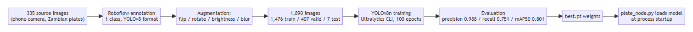

# Chapter 3: Methodology

## 3.1 Introduction

This chapter explains how the project was carried out: the development approach, how requirements and data were obtained, the architecture, the tools, the ethical considerations, and how success was measured.

## 3.2 Research / Development Approach

SVDS was built **iteratively**, not to a single up-front specification. The web application (backend and frontend) and the camera-node detection pipeline ran as two work-streams that meet at one integration point, the `POST /alerts/check-plate` endpoint. This let the model's cycle (collect data, annotate, train, evaluate) proceed without waiting on the CRUD and authentication work, and each side could be retested independently.

For the AI/vision component the approach is **experimental**: several training runs were made and compared (the `runs/detect/` directory holds runs named `svds-plate-detector`, `-2`, `-3`, `-final`, `-final-2` and others). The run `svds-plate-detector-final-2` produced the weights used by the camera node. The pipeline around the model was then refined against real footage from a phone camera, not only against the still-image validation set.

```
Requirements → Design → Implementation → Integration → Testing → (issues found? back to Requirements)
```

## 3.3 Requirements / Data Collection

**Requirements** were derived from (a) the gap in Chapter 1, (b) the natural three-way split of who touches a stolen-vehicle report (the person who filed it, the officer investigating, the administrator), and (c) the technical constraints of detection: a single cheap camera source, and no coupling of the detector to the backend's release cycle. No formal stakeholder interviews are recorded for this project; the requirements are the group's own analysis of the problem.

**Data.** Plate images were collected with phone cameras, the same class of device the deployed node uses, so that the training distribution (angle, lighting, blur, resolution) resembles the deployment distribution. They were annotated in Roboflow (project `zambia-number-plate-detection`, version 3) with one bounding-box class, and exported in YOLOv8 format.

| Split | Images on disk | Labels on disk |
|---|---|---|
| train | 1,476 | 1,476 |
| valid | 407 | 407 |
| test | 7 | 7 |
| **Total** | **1,890** | **1,890** |

These counts were obtained by counting the files in the exported dataset folder. The Roboflow README that accompanies the export says "The dataset includes 335 images" and describes 3 augmented versions per source image, which would give about 1,005 images and does not reconcile with 1,890. The training-split filenames, which have the form `<source-id>_jpg.rf.<hash>.jpg`, carry 1,270 distinct source ids for 1,476 images, the validation split 407 for 407, and the test split 7 for 7 (1,684 distinct ids in all). **No source id appears in more than one split**, so augmented copies of a photograph did not leak between training and validation. Because the README count, the 3× augmentation claim and the filename evidence do not agree, **the number of original photographs is left for the student to confirm from the Roboflow project**, and this report does not state it.

Roboflow pre-processing and augmentation, as recorded in the export README:

- auto-orientation (EXIF stripping) and resize to 640 × 640 (stretch);
- 50% chance of horizontal flip;
- random rotation between −15° and +15°;
- random brightness change between −25% and +25%;
- random Gaussian blur of 0–1.8 px (listed in the export README under bounding-box transformations).

## 3.4 System Architecture / Research Workflow

SVDS consists of three independently runnable processes that communicate only over the network: **`vrrs-backend`** (FastAPI and PostgreSQL), **`vrrs-frontend`** (React) and **`vrrs-node`** (the camera node). The camera node does not import anything from the backend.


The research workflow for the AI/vision component is shown below.



## 3.5 Tools and Technologies

| Area | Technology |
|---|---|
| Language | Python |
| Detection | Ultralytics YOLOv8 (`yolov8n.pt` base weights), PyTorch with CUDA |
| OCR | EasyOCR |
| Image and video handling | OpenCV (`cv2`) |
| Annotation and augmentation | Roboflow |
| Node ↔ backend transport | `requests` (HTTP/JSON) |
| Configuration | `python-dotenv` (`.env`) |
| Testing | pytest |
| Hardware | NVIDIA Quadro P2000 GPU (training and inference); Android phone running an IP Webcam app (MJPEG stream) |
| OS | Windows 11 |
| Rest of system (built by other members) | FastAPI, SQLAlchemy, PostgreSQL, React, Vite |

## 3.6 Ethical and Legal Considerations

- **Personal data in images.** Licence plates identify vehicles, and vehicles can identify owners. Training images should be photographs of vehicles in public places, taken for this project. The dataset should not be published with images that show people's faces. Whether the images were collected with any permission beyond public visibility is not recorded and should be stated by the student.
- **Data minimisation on the node.** The camera node forwards only the plate string, a confidence value, a camera identifier and a configured location string. It does not upload frames, and it holds no database access.
- **Licensing.** The dataset export carries a CC BY 4.0 licence. YOLOv8 (Ultralytics) is released under AGPL-3.0, and EasyOCR under Apache 2.0. Anyone deploying the system beyond an academic prototype needs to check that these licences suit their use.
- **Consequences of a false match.** A wrong plate reading could point officers at an innocent driver. The pipeline therefore favours precision over recall, matches only against reports that police have activated, and leaves the decision to a human officer who sees the alert. Officers can flag false positives in the web application.
- **Endpoint trust.** `/alerts/check-plate` is unauthenticated because the node has no user identity. It can only return `CLEAR` or create an alert against an already-active report, so it cannot alter reports. It should nevertheless sit behind a private network or an API key in a real deployment.
- **Security of the rest of the system** (passwords, JWT, role checks) is covered in the backend and security member's report.

## 3.7 Evaluation Method

1. **Model evaluation:** precision, recall, mAP50 and mAP50-95 from the training run's per-epoch record (`results.csv`), plus a re-run of the final weights on the validation and test splits.
2. **Unit testing** of the node's pure logic (plate cleaning and fuzzy de-duplication) with pytest, isolated from the GPU stack so the tests can run anywhere.
3. **System observation:** running the node against the live stream and backend and recording what was and was not observed.
4. **Objective-by-objective review** against the individual objectives O1–O6 in §1.4.

No user survey was run; there are no user-evaluation results in this report.

## 3.8 Chapter Summary

The project followed an iterative approach with an experimental training loop for the model. Data was collected with phone cameras, annotated in Roboflow, and exported as 1,890 labelled images. The tools are open-source Python libraries on a GPU-equipped Windows machine. Evaluation combines model metrics, unit tests and system observation.
