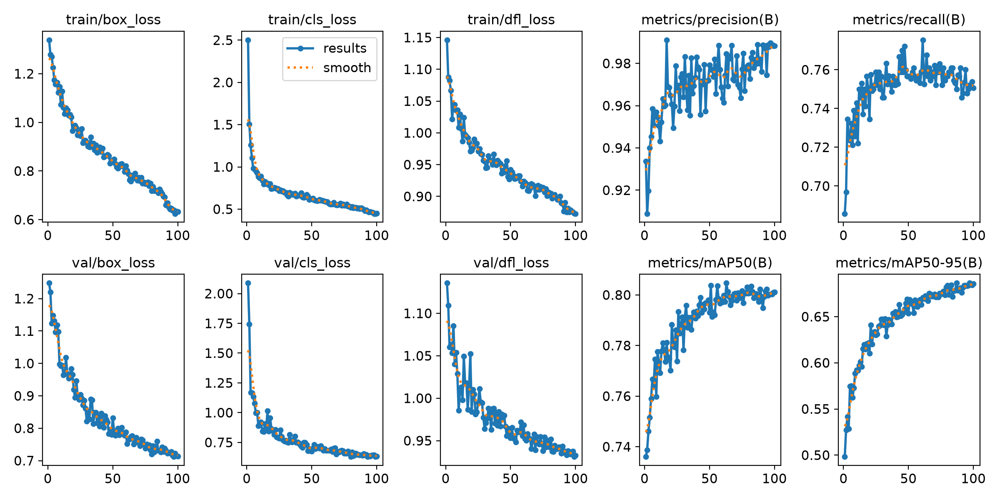
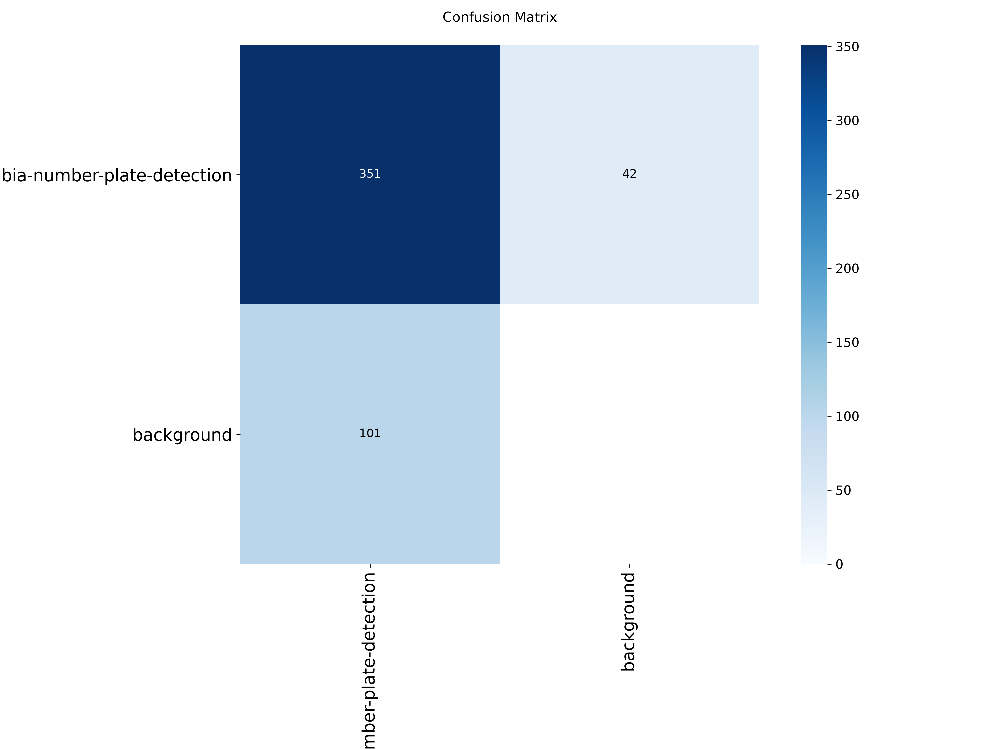
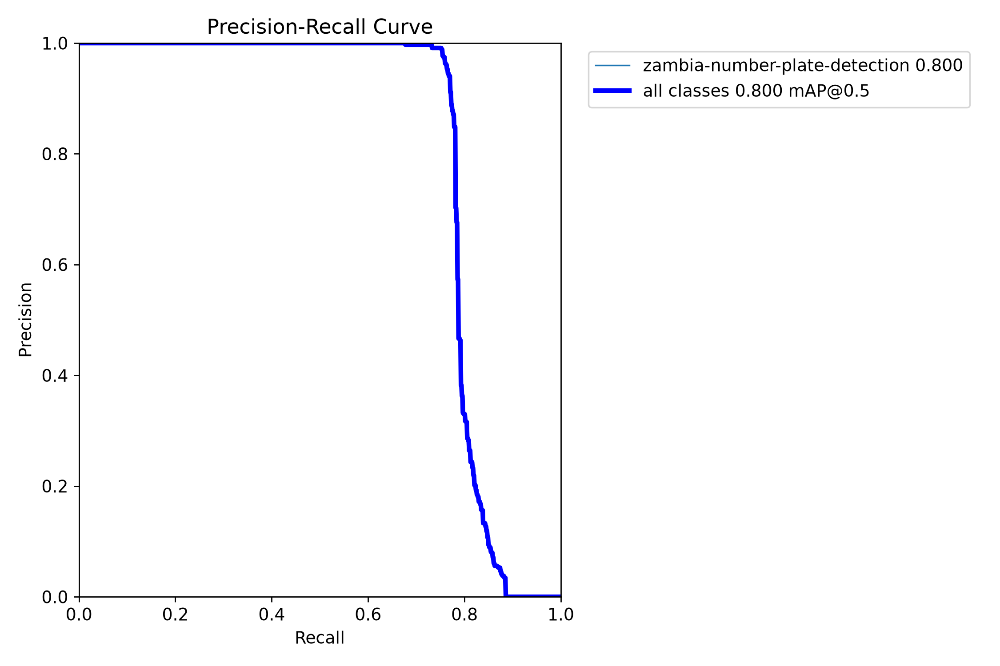
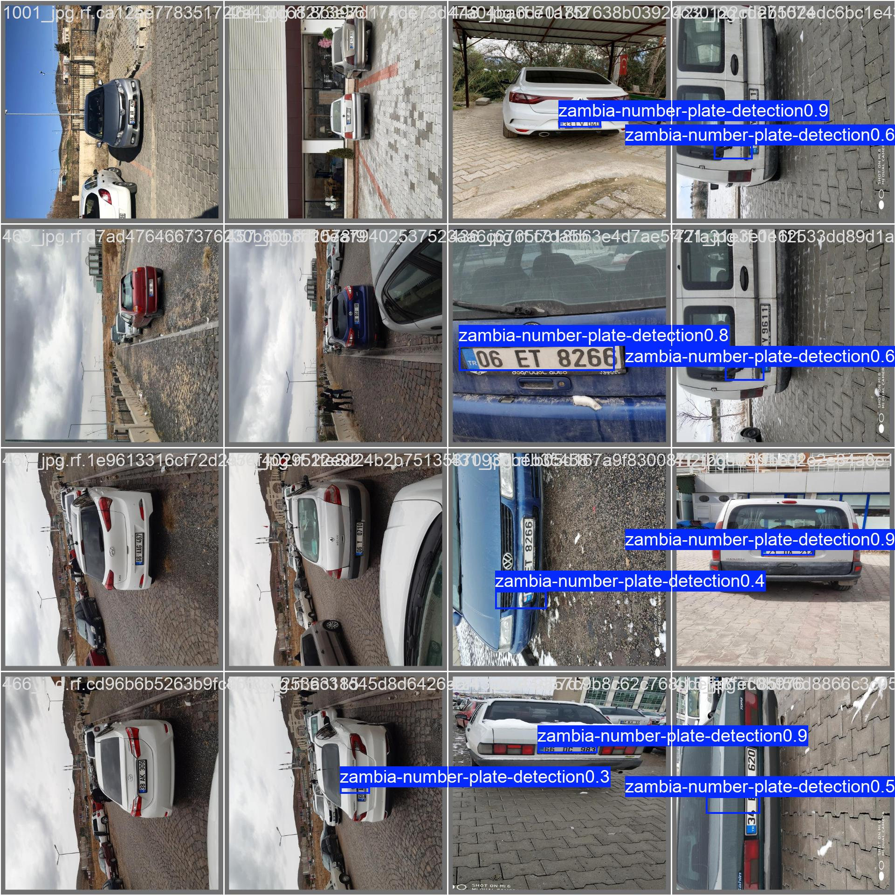
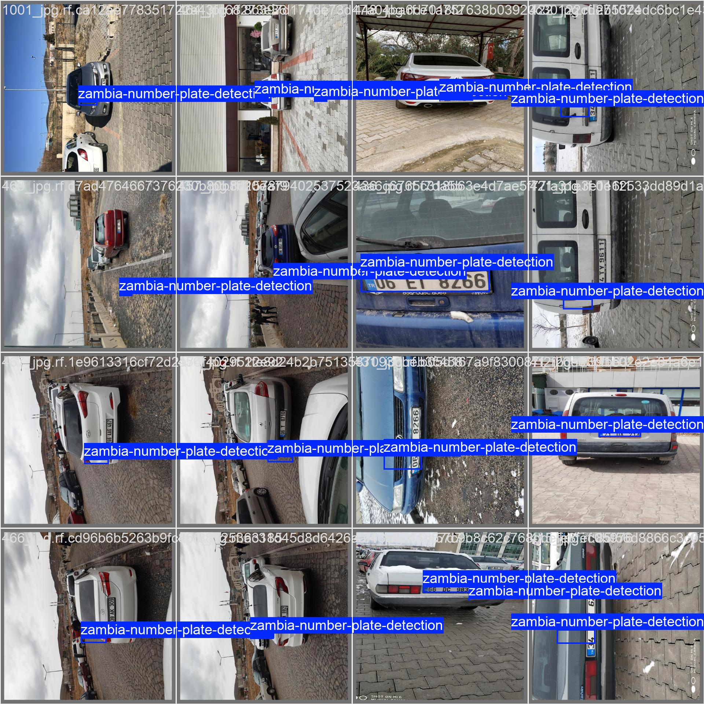

# Chapter 6: Testing, Results and Evaluation

## 6.1 Introduction

This chapter evaluates the AI/vision component. It reports what was measured, what was observed, and, just as importantly, what was **not** measured. Every number below comes from a file or a command output that can be inspected: `results.csv`, `eval_results.json`, the pytest output, and the node's own log.

## 6.2 Testing Strategy

| Level | Technique | Target |
|---|---|---|
| Model evaluation | Precision, recall, mAP on held-out splits | The YOLOv8n plate detector |
| Unit testing | pytest on pure functions, with no GPU stack | `plate_utils.py` (cleaning, de-duplication) |
| Robustness observation | Running the node against unreachable and dropped streams | `plate_node.py` start-up and reconnection |
| System testing | Live phone stream → node → backend → dashboard | Partly achieved: live readings reached the backend; no `STOLEN` alert recorded (§6.4.3) |
| Acceptance / user testing | None carried out | See §6.5 |

## 6.3 Test Cases and Results

**Table 6.1: Test cases for the AI/vision component**

| ID | Test Case | Expected Result | Status |
|---|---|---|---|
| TC-01 | `clean_plate_text` given lower case and punctuation (`"baa 1234"`, `"BAA-1234"`) | `"BAA1234"` in both cases | Pass |
| TC-02 | `clean_plate_text` given text shorter than 5 or longer than 8 characters | `None` (discarded) | Pass |
| TC-03 | `clean_plate_text` given only symbols | `None` | Pass |
| TC-04 | Same plate re-read inside the cooldown window | Treated as duplicate | Pass |
| TC-05 | OCR-jitter variants of one plate (`ALX3665`, `ALK3665`, `AL3065`-style) inside the window | Treated as duplicates | Pass |
| TC-06 | A genuinely different plate inside the window | Not a duplicate | Pass |
| TC-07 | Same plate after the cooldown has expired | Not a duplicate | Pass |
| TC-08 | Expired entries in the sightings list | Pruned from the list | Pass |
| TC-09 | Detector on the validation split (407 images) | Precision above 0.95 and mAP50 above 0.75 | Pass (0.990 / 0.797) |
| TC-10 | Detector on the test split (7 images) | Reported, no threshold set | Reported (§6.4.2) |
| TC-11 | Start node with an unreachable stream | Clear error, not a silent hang | Pass (observed, §6.4.3) |
| TC-12 | Stream drops while the node is running | Node retries instead of exiting | Pass (observed in the node's log, §6.4.3) |
| TC-13a | Live phone stream → node → backend, plate not on the stolen list | Backend returns `CLEAR` | Pass (8 live readings, §6.4.3) |
| TC-13b | Live stream → node → backend → dashboard alert for an active report | `STOLEN` and a dashboard alert | **Not verified** |
| TC-14 | End-to-end OCR accuracy on real plates | A measured character or plate accuracy | **Not measured** (no text ground truth) |

TC-01 to TC-08 correspond one-to-one to the eight tests in `vrrs-node/tests/test_plate_utils.py`. The suite was re-run while preparing this report: **8 passed in 0.06 s** (Appendix D). The exact inputs are in the test file; TC-04 to TC-08 above are summaries of them.

## 6.4 Experimental Results / Performance Results

### 6.4.1 Training results (validation split)

Final-epoch (epoch 100 of 100) values from `results.csv`, alongside epoch 97, which Ultralytics' fitness measure (0.1 × mAP50 + 0.9 × mAP50-95) selects as best:

| Metric | Epoch 100 | Best-fitness epoch (97) |
|---|---|---|
| Precision | 0.988 | 0.990 |
| Recall | 0.751 | 0.752 |
| mAP50 | 0.801 | 0.800 |
| mAP50-95 | 0.686 | 0.686 |

`best.pt` is the checkpoint saved at the best-fitness epoch, so the deployed weights correspond to the epoch-97 column (assuming training was not resumed, which the record does not show).

**Re-evaluation of the deployed `best.pt`** with `evaluate_model.py` (validation split, 407 images, 452 plate instances):

| Split | Images | Instances | Precision | Recall | mAP50 | mAP50-95 |
|---|---|---|---|---|---|---|
| Validation | 407 | 452 | 0.990 | 0.752 | 0.797 | 0.690 |
| Test | 7 | 11 | 0.764 | 0.909 | 0.881 | 0.725 |

Inference time on the Quadro P2000 was about 11.2 ms per image for the model alone (preprocess 0.8 ms, postprocess 1.9 ms). This excludes OCR, the HTTP call and video decoding, so it is **not** the frame rate of the whole node.

### 6.4.2 Test split

The test split holds only 7 images with 11 plates. Its precision (0.764) is far below the validation precision (0.990), and its recall (0.909) is above it. With 11 instances, one or two false detections move precision by tens of percentage points, so these figures show that the model works on unseen images but **cannot be used to estimate the true error rates**. A larger test set is needed.

### 6.4.3 Robustness observations

- **Live readings reached the backend (TC-13a).** The node's log `vrrs-node/node_live.log` (last modified 14 September 2026) records a real run: the detector loaded on `cuda`, the node connected to the phone stream, and eight readings were posted to the backend, each answered `backend status: CLEAR`. The readings were `ALK3665`, `AK3665`, `ALX3665`, `ALK3665`, `ALLX3665`, `ALX3665`, `XI5998` and `G9QEXIH`. The first six differ by one or two characters and appear to be repeated, noisy reads of one plate; the log does not say what the true plate was. This run shows the phone → node → backend path working, and that the backend was reached and answered.
- **The same log is the evidence for the de-duplication fix.** Six near-identical reports of one apparent plate in one run is the OCR-jitter problem described in §4.9.3. The run predates the fuzzy-matching fix (the fix and its unit tests were written afterwards), so it shows the problem, not the fix working on live footage.
- **Unreachable stream at start-up (TC-11).** When the system was later started, the phone's address was unreachable (a TCP test to the configured address failed). The node loaded YOLOv8n and EasyOCR, then stopped with an explicit `Could not open video stream...` error naming the likely causes, as designed.
- **Stream loss while running (TC-12).** The same live log ends with an OpenCV/FFmpeg stream timeout after about 30 s followed by `Lost connection to stream, retrying...` (twice), showing the retry branch executing instead of the node exiting. The log does not show a later successful reconnection, so recovery *after* the stream returns is not demonstrated.

### 6.4.4 What was not verified

- **No recorded `STOLEN` match** (TC-13b). All eight live readings returned `CLEAR`. There is no recorded run in which a real vehicle's plate matched an active report and produced an alert on the dashboard, and the camera-node preview window has not been captured. Latency from a plate becoming visible to an alert appearing has therefore **not been measured**, and no latency figure is claimed. It is also not known whether the plate in the log was ever on the stolen list.
- **No OCR accuracy figure** (TC-14). The dataset labels where plates are, not what they say, so read accuracy cannot be computed from it. Producing that number needs a set of plate crops with typed ground-truth strings.
- **No comparison of alternatives**, for example with and without the greyscale, upscale and threshold stage, or with other similarity thresholds.

## 6.5 User Evaluation

None carried out. No officers, operators or members of the public tested the node, and no survey or interview data exist.

## 6.6 Analysis of Results

- The validation metrics show a detector that is **precise but misses about a quarter of plates** in still images (precision 0.99, recall 0.75). In `results.csv`, mAP50 is already about 0.78 at epoch 10 and reaches about 0.80 at epoch 100, and mAP50-95 rises from about 0.59 to 0.686 with only about +0.004 over the last ten epochs. More epochs alone would therefore give little. More or more varied data, especially examples of the missed cases, is the more promising lever.
- The re-run of the deployed weights matches the recorded training metrics to within about 0.005 on every measure, which confirms that `best.pt` is the model that was trained and evaluated, and that the recorded numbers are reproducible.
- The test split contradicts the validation picture on precision. With 11 instances it is inconclusive, but it is a reminder that the validation score is measured on images from the same collection effort and may overstate performance on new scenes.
- The unit tests show that the parts of the pipeline that could be isolated behave as specified, in particular that jittery re-reads of one plate are suppressed while a different plate is not.
- The live log shows the pipeline reading real plates and reaching the backend, but the absence of OCR accuracy and of a recorded `STOLEN` alert means the *pipeline as a whole* is supported by design, component evidence and a partial live run, not by a measured end-to-end result.

## 6.7 Objective-by-Objective Evaluation

| Objective | Evidence | Verdict |
|---|---|---|
| O1: Collect and annotate a dataset with train/validation/test splits | 1,890 labelled images in three splits, no source-id overlap between splits (§3.3). Original photograph count unconfirmed; test split very small | **Achieved**, with the caveats stated |
| O2: Train a detector reaching precision above 0.95 and mAP50 above 0.75 on validation | 0.990 precision, 0.797 mAP50 (re-run); 0.988 and 0.801 at epoch 100 | **Achieved** |
| O3: Read plate text with OCR and validate its format | Implemented in `plate_node.py` and `clean_plate_text`; validation logic unit-tested (TC-01 to TC-03). OCR read accuracy not measured | **Achieved in implementation; accuracy unproven** |
| O4: Suppress repeated reports despite OCR noise | Fuzzy de-duplication implemented; TC-04 to TC-08 pass | **Achieved** at unit level; not measured on live footage |
| O5: Decoupled camera node that reports over HTTP and recovers from stream loss | Separate process, single HTTP contract; 8 live readings posted and answered `CLEAR` (TC-13a); retry branch observed (TC-12); no `STOLEN` alert recorded, and reconnection after recovery not shown | **Largely achieved**: reporting demonstrated live; alert path and recovery not demonstrated |
| O6: Evaluate the model and node quantitatively and by automated tests | Metrics in §6.4, 8 passing tests | **Achieved** for the model and the pure logic; not for the whole pipeline |

## 6.8 Individual Results

All results in this chapter are attributable to the student's own component. Results of the backend (including `check-plate` tests), real-time delivery and frontend are in the other members' reports and are not reproduced or claimed here.

## 6.9 Chapter Summary

The detector meets its numeric targets on the validation split (precision 0.990, mAP50 0.797), the eight unit tests pass, and the node's start-up and stream-loss behaviour was observed. A live run showed eight readings reaching the backend, but a `STOLEN` alert on the dashboard, OCR accuracy and latency were not recorded, and the seven-image test split is too small to be conclusive.
